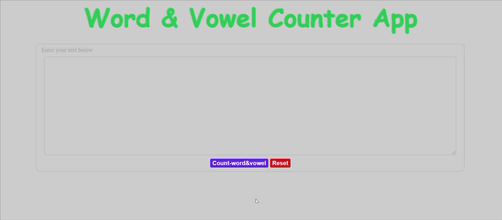

# **Word-Vowel Counter App**

 This application is simply written in ***JavaScript, HTML and CSS***

 Live Version ***[here](https://komalgill0310.github.io/WORD-VOWEL-COUNTER/)***

# **Summary**

* **Tools:** RegEx, addEventListener, getElementById
* **How the app work?**
  * After typing in the textBox, it displays the total number of words and vowels included in the text on the screen when the **count word&vowel button** is clicked. 
  * Users can reset an app by clicking the **Reset button**.
* It was a great project for getting a better understanding of **Regular Expressions**.

# Author
Komal - | Software Developer | Personl Website is in progress | [LinkedIn](www.linkedin.com/in/komalpreet-kaur-3b6924177)